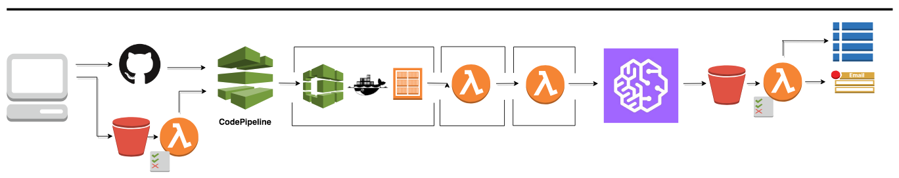

## CICD Pipeline for Training Models with Amazon SageMaker

.


The aim of this project is to present candidate pipeline which continuously builds a docker image of the training algorithm and invokes a SageMaker training job based on the parameters provided during stack creation.
This pipeline is executed:
    1- Whenever a new commit is push to the Github repo branch (that holds your training algorithm)
    2- Whenever a data object is created or updated in the TrainingInputBucket under the S3 keys "/input/data/"

**Note**: If no data is present in the input/data/training location of the TrainingInputBucket then as explained below synthetic data is copied over to this location

----


### Step 1 Set Up AWS Account

Create an AWS account if you have not done so already and also make sure you have AWS CLI configured to create the stack from the terminal.
You should also have the relevant permissions to be able to create IAM roles.

**Note**: You may incur cost ($) utilizing the resources that constitute this pipeline.


### Step 2 Prepare the Training Code as Packaged Python Module

The source code for your training algorithm should be in the form of a python package with setup.py file in the root level of a Github repository.
Information about this Github repository, username, branch and personal access token would be provided as parameters when creating the cloudformation stack.

An example of such a simple packaged model can be found here: [tf_gamesbiz model](https://github.com/MustafaWaheed91/tf-gamesbiz).

As you will note in this example repo the actual module which initiates the model training is located in the root level of the repository named "gamesbiz".
within this gamesbiz module I have a sub module *train.py* where I have a function entry_point() that kicks off the model training. This information can be
provided in the setup.py file (which is also located in the root level of the source repository).

Make sure the *setup.py* file for your own packaged training algorithm should be arranged the same as in the example.
See the following generic example of *setup.py*


```
from setuptools import setup, find_packages

setup(
    name='<your python package name>',
    version='0.0.1rc0',

    # Package data
    packages=find_packages(),
    include_package_data=True,

    # Insert dependencies list here
    install_requires=[
        'numpy',
        'scipy',
        'pandas',
        'scikit-learn',
        'tensorflow',
        '<external_python_package>',
        '<external_python_package>',
    ],

    entry_point={
        "gamesbiz.train":"entry_point"
    }
)

```

Make sure that for your own modules *setup.py* you enter the entry_point argument like shown below:

```
setup(
   ...

     entry_point={
        "<module resource path>":"<Name of the Function that kicks of training>"
    }

   ...
)
```

Here the *<module resource path>* is the path to the module or sub-module (depending on the contents of the __init__.py file in your modules top level) which contains the function that will strat training your model.
And *<Name of the Function that kicks of training>* is just the string with the name of the function without "( )" for the example project [tf_gamesbiz model](https://github.com/MustafaWaheed91/tf-gamesbiz)
the function it self was also name entry_point (under gamesbiz.train).

This additional *entry_point* argument provides all the information the pipline needs to build a SageMaker compatible docker image. You'll see this in the
steps that follow. Once this is done whenever you push a commit to the repo with your


### Step 3 Create Synthetic Data Bucket

Make sure you have a "Synthetic Data Bucket" that you provided as parameter in CF template. Some sample input data should be present under the S3 key equivalent to the Github repository name i.e under '<synthetic-data-bucket>"/<Github-Repository-Name>/"
This is not exactly a strict requirement but this type of sample data is usefull in the context of the pipeline conducting an overall integration test for the fist execution on setup.

Regardless of the first execution, whenever you upload new data to the *TrainingInputBucket* the pipeline should re-execute given that its not already in progress.

**Note**: The Github repository name is not the url


### Step 4 Create Pipeline Stack

You can either run the following bash script *./launch-cicd-pipeline.sh* . In the bash script define the environment variables as instructed below and then use aws cli command to create the stack.
*you can view the progress of the template in the console*

```
#!/bin/bash
Email=<Enter your Email Address>
GitHub_User=<Enter Github Organization Name or Github Username>
GitHub_Repo=<Enter Name (Only) of Github Repository>
GitHub_Branch=<Enter branch name for source for pipeline stage>
GitHub_Token=<Enter Personal Access Token from Github>
Python_Build_Version="aws/codebuild/python:3.6.5-1.3.2"
Template_Name=${GitHub_Repo}-cicd-pipeline
AWS_DEFAULT_REGION=us-east-1

aws cloudformation create-stack \
  --region ${AWS_DEFAULT_REGION} \
  --stack-name $Template_Name \
  --template-body file://template/sagemaker-pipeline-v2.yaml \
  --parameters \
    ParameterKey=Email,ParameterValue=$Email \
    ParameterKey=GitHubUser,ParameterValue=$GitHub_User \
    ParameterKey=GitHubRepo,ParameterValue=$GitHub_Repo \
  	ParameterKey=GitHubBranch,ParameterValue=$GitHub_Branch \
  	ParameterKey=GitHubToken,ParameterValue=$GitHub_Token \
    ParameterKey=PythonBuildVersion,ParameterValue=$Python_Build_Version \
  --capabilities CAPABILITY_NAMED_IAM

```

### Step 5 Trigger and Track Execution

Once the Stack has been successfully deployed you can trigger the pipeline by either uploading new data to the TrainingInputBucket under the input/data/ key prefix, or by
pushing a commit to the Github repository branch specified when creating the CF stack.
Either way the Source, Build, Validate Inputs and SageMaker Trigger stages in the CodePipeline are re-executed.

** You can see the pipeline execution in the console via the link provided in the CloudFormation stack "output" **

Once the SageMaker Training Job finishes and model artifact is pushed to the S3 bucket you will recieve an email notification (assuming you suscribed to the PipelineEndSNSTopic during stack creation).

** You can track the git hash, input data object version(s), along with SageMaker Training Job status/meta data in DynamoDB table**
this is the MetaDataStore table also referenced in CloudFormation stack "output".


### Step 6 Tear Down Stack when Needed

To tear down the resources (other than ECR repo and Input and Output S3 buckets) in the stack just delete the CF stack from the cloud formation console.


### Assumptions

1. Some familiarity with packaging code in python is assumed
2. Familiarity with Machine Learning is also assumed
3. Know how to generate a Personal Access Token in Github

----

  
## Built With

* [AWS CodePipeline](https://aws.amazon.com/codepipeline/) - Continous Integration Service
* [AWS CodeBuild](https://aws.amazon.com/codebuild/) - Fully Managed Build and Test Service
* [Amazon SageMaker](https://aws.amazon.com/sagemaker/) - Machine Learning Framework that Scales
* [Amazon S3](https://aws.amazon.com/s3/) - Simple Storage Service 
* [Amazon DynamoDB](https://aws.amazon.com/dynamodb/) - Non Relational Database
* [AWS Lambda](https://aws.amazon.com/lambda/) - Serverless Compute Service


## Author

* **Mustafa Waheed** - *Data Scientist*
