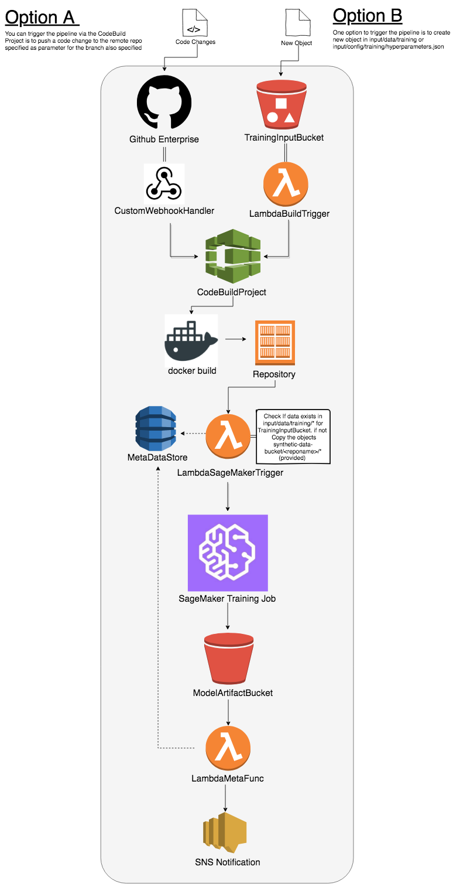

## CICD Pipeline for Training Models on Amazon SageMaker


The aim of this project is to continously build training images and trigger a sagemaker training job everytime the code changes (or data updates in the Training Input Bucket).

**Pleas read the github wiki on this project**

----

### Prerequisites

1. Create an AWS account if you have not done so already.
2. Make sure you have AWS CLI configured to create the stack from terminal.
3. The source code for your training algorithm should be in the form of a python package with setup.py file in the root level of the Github repository.


### Getting Started 

You can either run the following bash script *launch-cicd-pipeline.sh* . In the bash script define the enviornment variables as instructed below and then use aws cli command to create the stack.

*you can view the progress of the template in the console*

```
#!/bin/bash
Email=<Enter your Email Address>
GitHub_User=<Enter Github Organization Name or Github Username>
GitHub_Repo=<Enter Name (Only) of Github Repository>
GitHub_Branch=<Enter branch name for Enterprise Github Webhook a.k.a pipeline trigger>
GitHub_Token=<Enter Personal Access Token from Github>
Python_Build_Version="aws/codebuild/python:3.6.5-1.3.2"
Template_Name=${GitHub_Repo}-sgmkr01-pipeline
AWS_DEFAULT_REGION=us-west-2

aws cloudformation create-stack \
  --region ${AWS_DEFAULT_REGION} \
  --stack-name $Template_Name \
  --template-body file://template/cicd-pipeline.yaml \
  --parameters \
    ParameterKey=Email,ParameterValue=$Email \
    ParameterKey=GitHubUser,ParameterValue=$GitHub_User \
    ParameterKey=GitHubRepo,ParameterValue=$GitHub_Repo \
    ParameterKey=GitHubBranch,ParameterValue=$GitHub_Branch \
    ParameterKey=GitHubToken,ParameterValue=$GitHub_Token \
    ParameterKey=PythonBuildVersion,ParameterValue=$Python_Build_Version \
  --capabilities CAPABILITY_NAMED_IAM
```

### Pipeline Overview  

  
. 
  
The following steps are assumed to take place after the CloudFormation stack has been created successfully.
(either by the shell script provided or through the AWS Console)

#### Triggering Pipeline 
The user has 2 options to trigger this pipeline. One is to modify the code and push changs up to the source repo branch that this pipeline is configured for. The second is to upload new data (objects) in the TrainingInputBucket _"input/data/"_ location. 

**Note**: This pipline can also be scheduled using cloudwatch events with this CodeBuild project as a trigger. [Click here to see how](https://docs.aws.amazon.com/AmazonCloudWatch/latest/events/CloudWatch-Events-tutorial-codebuild.html).  

#### Create SageMaker Compatible Dockerfile and Build Image
The first part of the pipeline uses AWS CodeBuild where we start off the build by installing dependencies from artifactory and then in the *Pre-Build* phase creating the Dockerfile and source distribution (installable) for the python package with entry point defined. This entry point will have a function or command to run model training for the ML model.  
This is done using _setuptools-docker_ 
* [Link](https://github.intuit.com/data-science/setuptools-docker). 

Then in the *Build* context we use docker to build and tag this image defined for the python package executing the training job.

Note: Both the Dockerfile and the package tar.gz are created in ./dist/ directory.  

#### Push Trainin Job Image to ECR
Then we move to the *Post-Build* phase of CodeBuild build specification and push the built image to ECR.  

#### Trigger Lambda Function to Execute SageMaker Training.
The final step in code build will be to kick-off the AWS Lambda function that itself will kick off SageMaker training job. This is done after making sure to check that the input/data/training/** location has data in it. (If no data is foud synthetic data is copied over form a bucket specified in the parameters of the CF template.) (Meta Data about the pipeline execution is also written to a DynamoDB table).

#### Output Artifact loaded to S3
Once the SageMaker Job comletes it moves the artifact into the artifact bucket. This bucket having Lambda notification enabled invokes the final Lambda function which writes some meta data about the completed job to the item referencing the current trainig job in the DynamoDB table (as seen in the diagram above).  

This lambda function also publishes to the SNS topic also declared in the stack. Since the email parameter is suscribed to this SNS topic the user gets sent an email notification after each successful run. 


----

  
## Built With

* [AWS CodeBuild](https://aws.amazon.com/codebuild/) - Fully Managed Build and Test Service
* [Amazon SageMaker](https://aws.amazon.com/sagemaker/) - Machine Learning Framework that Scales
* [Amazon S3](https://aws.amazon.com/s3/) - Simple Storage Service 
* [Amazon DynamoDB](https://aws.amazon.com/dynamodb/) - Non Relational Database
* [AWS Lambda](https://aws.amazon.com/lambda/) - Serverless Compute Service
* [Github API](https://enterprise.github.com/home) - Famous Git Based Remote Repositories


## Author

* **Mustafa Waheed** - *Data Scientist*
